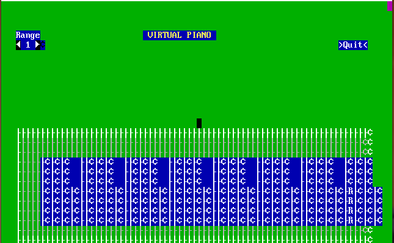

# CPP_Keyboard_to_Virtual_Piano
It is a simple GUI app using C++.It is pretty much an electronic piano which maps the piano sounds with the keys on the keyboard. The purpose of this virtual  piano is to provide a playable piano allowing any user to play the piano without having access to an actual one. The design of the virtual piano action is composed of a virtual keyboard with 7 frequencies and having audio capabilities. The best part of this application is , a person can play it anywhere as he/she will just need a desktop/ laptop and Turbo C installed in their system. At last , this is absolutely free of cost and portable.

### Interface

